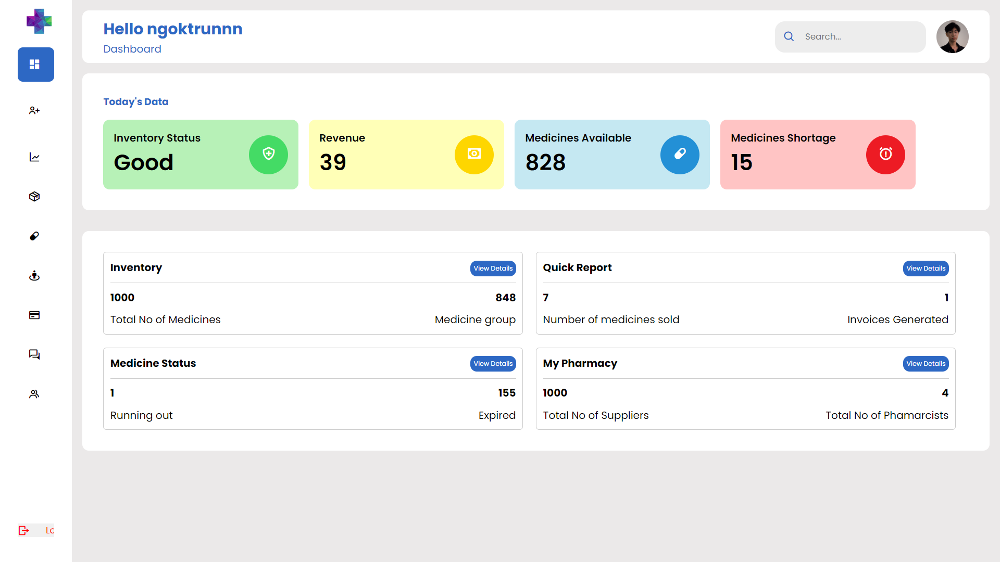
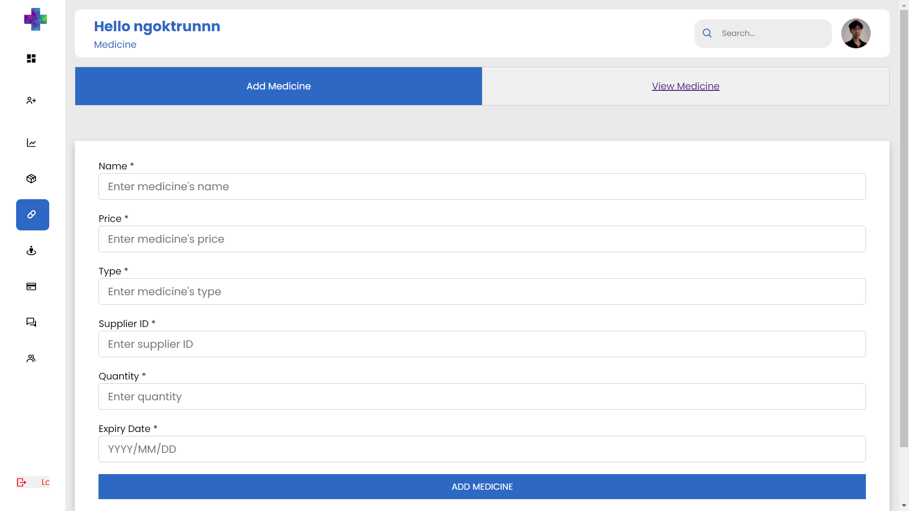
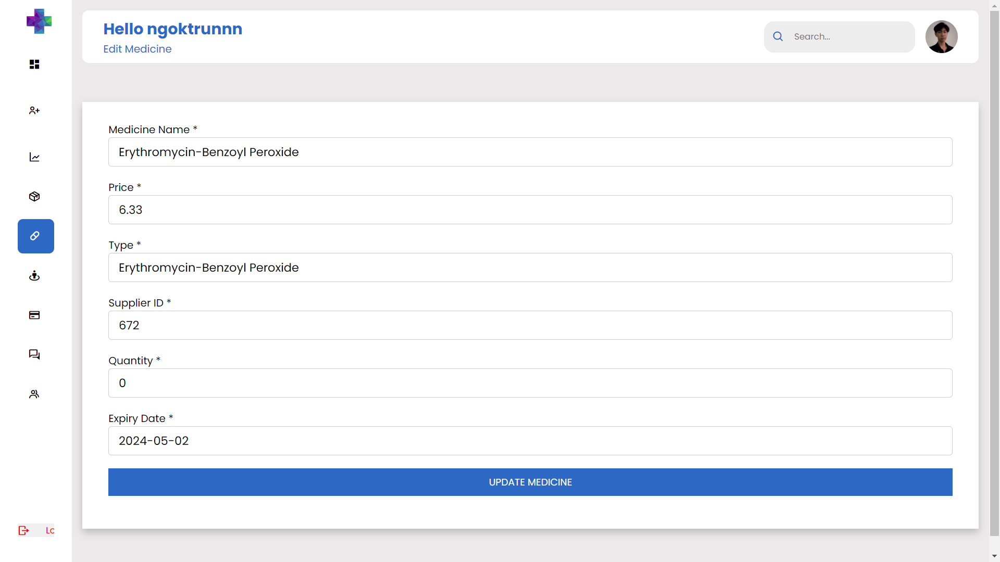
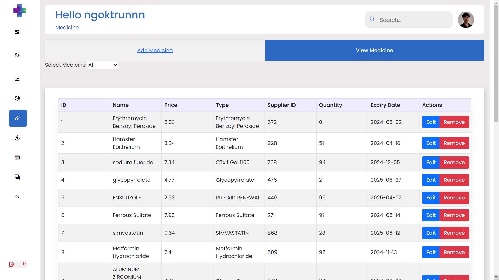
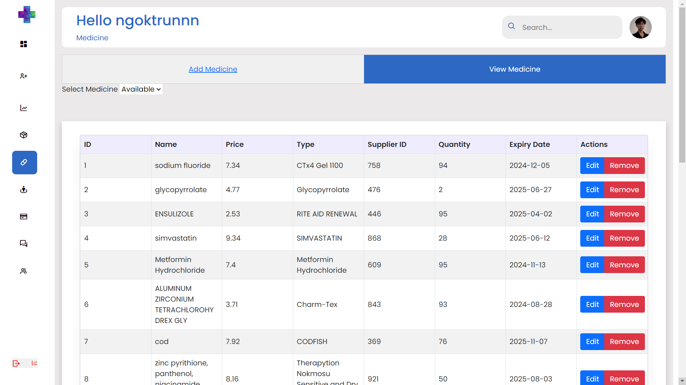
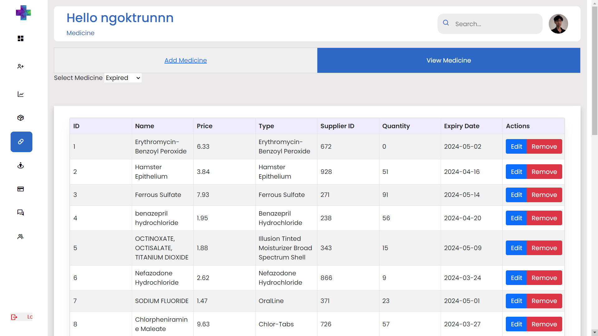

# vgupe2024_team3

## Project: Pharmacy Management System

## Members:

1. Nguyễn Ngọc Trường - ID: 10421066 - Frontend Developer - Product Owner (Leader)
2. Mai Ngô Anh Khoa - ID: 10421027 - Database Administrator
3. Lê Hữu Trịnh Kha - ID: 10421023 - Database Administrator
4. Lê Thái Dương - ID: 10421012 - Backend Developer
5. Trần Cao Gia Bảo - ID: 10421005 - Frontend Developer
6. Trần Việt Trung - ID: 10421065 - Backend Developer
7. Văn Anh Thư - ID: 10421105 - Backend Developer

## Report 

https://www.overleaf.com/read/vggykpmrdsmd#e35865

# Documentation

## Table of Contents

1. [Introduction](#introduction)
2. [Project Overview](#project-overview)
   - [Technology Stack](#technology-stack)
   - [Features](#features)
3. [Requirement Analysis](#requirement-analysis)
   - [Functional Requirements](#functional-requirements)
   - [Non-Functional Requirements](#non-functional-requirements)
4. [System Design](#system-design)
5. [Code Structure](#code-structure)
6. [Usage Guide](#usage-guide)
   - [Navigating the Dashboard](#navigating-the-dashboard)
   - [Using the Add Medicine Function](#using-the-add-medicine-function)
   - [Generating an Invoice](#generating-an-invoice)
   - [Adding a Supplier](#adding-a-supplier)
   - [Using the Chat Function](#using-the-chat-function)
7. [Conclusion](#conclusion)

## Introduction

The aim of this project is to develop an application for the effective management of a pharmaceutical store. It helps the pharmacist to maintain the records of the medicines/drugs and supplies sent in by the supplier. The admin who are handling the organization will be responsible to manage the record of the employee. Each employee will be given with a separate username and password. The users can communicate each other by using a built-in messaging system. Pharmacy management system deals with the maintenance of drugs and consumables in the pharmacy unit. It application can generate invoices, bills, receipts etc.

## Project Overview

### Technology Stack

- **Backend:** PHP
- **Frontend:** HTML, CSS, JavaScript, React
- **Database:** MySQL
- **Development Environment:** XAMPP

### Features

- Dashboard for navigation
- User authentication (Sign up and login)
- Role-based access control
- Data interaction functions: Add Medicine, Generate Invoice, Add Supplier, Chat

## Requirement Analysis

### Functional Requirements

* **Drug Inventory Management**

  * Add drug to inventory
  * Remove drug from inventory
  * Search drug
  * Check drug availability
  * Suggest alternative drugs
  * Search based on attribute (ingredient, pricing, attribute)
  * Calculate pricing
  * Print receipts / Generate invoice
* **User Roles and Capabilities**

  **- Pharmacist**

  * Add drug to order
  * Remove drug from order
  * Search if the drug is in stock
  * Search availability in other branches

  **- Admin / Manager**

  * Pharmacy settings
  * Track inventory
  * Set and edit price
  * Set and edit code
  * Set and edit stock quantity
  * Set and edit attributions
  * Credential / Authorization management
  * Add and remove pharmacists
  * Client/buyer database management
  * Track past purchases
  * Manage user credit (optional)
  * Track and manage pharmacists
  * Check records of pharmacists
  * Add supplier
* **System Functions**

  * Login and Sign up
  * Real-time synchronization
  * Reporting and analytics
  * Restore and backup system (optional)
  * Customer management system (optional)
* **Messaging System**

  * Send message to a user
  * Receive message
  * Send picture (optional)

### Non-Functional Requirements

* **Performance**
  * The system should handle real-time synchronization efficiently.
  * Reporting and analytics should process data promptly to provide timely insights.
* **Reliability**
  * The system should provide reliable backup and restore options (if implemented).
  * Messaging system should ensure reliable delivery and receipt of messages.
* **Security**
  * Secure login and sign-up processes.
  * Proper authorization mechanisms for pharmacists and admins.
  * Data encryption for sensitive information.
* **Usability**
  * User-friendly interface for pharmacists and admins.
  * Easy navigation through the dashboard and various functionalities.
* **Scalability**
  * The system should handle increasing amounts of data and users.
  * Efficiently manage additional branches and extended functionality as needed.
* **Maintainability**
  * The codebase should be well-documented and modular to facilitate easy updates and maintenance.
  * System should be designed to handle future enhancements with minimal disruption.
* **Compatibility**
  * The system should be compatible with various browsers and devices.
  * Ensure integration capabilities with existing pharmacy systems and databases.
* **Availability**
  * Ensure high availability with minimal downtime.
  * Provide robust support for real-time synchronization and data access.

## System Design
The system architecture of the Pharmacy Management System is designed to ensure scalability, robustness, and ease of maintenance. The architecture follows a multi-tier approach, consisting of the following layers:
- **Presentation layer:** This layer includes the user interface components, facilitating interaction between the users and the system. The technologies used in this layer include HTML, CSS, JavaScript, and a server-side language like PHP.
- **Application layer:** This layer contains the business logic and functionalities of the system, implemented using PHP.
- **Data later:** This layer manages data storage and retrieval, using a relational database management system (RDBMS) like MySQL. It includes database schemas, tables, and relationships.

## Code Structure
The code first starts with open a connection to the MySQL database through an open connection with a database Handler through databaseHandler.inc.php with $pdo as the variable we use to interact with the database. First, we set up the connection to the database with mysql_connect command and set $pdo as a new PDO variable.

Next, we initiate a session cookie and create a _SESSION variable that store all the information in that session. We set the session's configuration through config_session.inc.php, in which we set the session's parameter such as lifetime, domain, path, etc... Then we start the session and regenerate the session based on if the user is logged in or not.

The above implementations are set in the include folder and alongside with login, signin and logout functionalities as they are heavily involved with the user's session. Beside that, all the system functionality are separated with each other as they are in their own designated folder. For example, all code base that involved with the creation, editing and viewing of invoice are stored in the invoice folder. The same are assumed with  the other functionalities except stated otherwise.

## Usage Guide
### Navigating the Dashboard

### Login Site

### Using the CRUD Medicine Function

### Create Account Function

### View and edit account Function

### Sale Tracking

### Generating an Invoice

### Using CRUD Supplier Function

### Using the Chat Function

## Conclusion
The Pharmacy Management System developed by the team is a comprehensive, efficient, and user-friendly solution for the pharmaceutical industry. It leverages robust technologies to address the diverse needs of pharmacists and administrators, enabling pharmacies to streamline inventory management, financial processes, and internal collaboration, ultimately providing a superior customer experience. The system's primary objective is to improve the overall efficiency and productivity of pharmaceutical stores by delivering enhanced inventory control, financial management, and communication capabilities. As the Pharmacy Management System is deployed, it is anticipated to play a pivotal role in optimizing pharmacy operations, reducing costs, and enhancing patient care, positioning it as a valuable asset for the pharmaceutical industry's success and growth.
